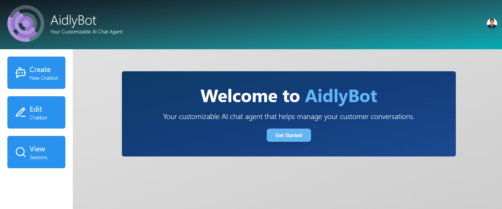
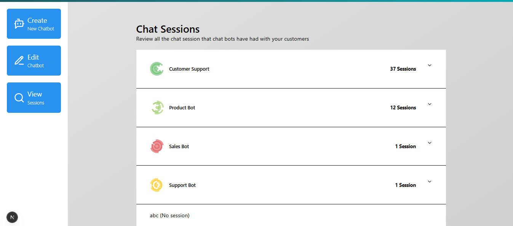
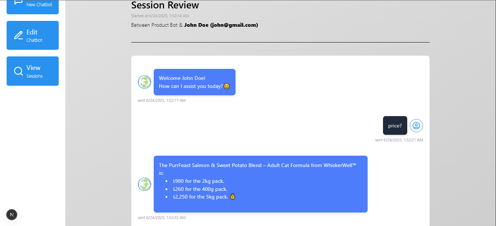

# 🤖 Aidly Bot – Customizable AI Chatbot Platform

**Aidly Bot** is a modern, customizable AI assistant platform built with Next.js 15, designed to power intelligent conversations between users and customers through purpose-specific chatbots. Whether you're creating an internal support agent, a domain-specific assistant, or an educational chatbot, Aidly Bot offers the flexibility and structure to manage it all.

---

## 🖼️ Preview

  
  
  
  

---

## 🔗 Live Demo : [View Live Demo](https://aidlybot.vercel.app)

---

## 🚀 Features

- 🧠 **AI Chatbot Sessions**: Real-time chat interface with dynamic session creation  
- 🔐 **Authentication** with Clerk, including admin and guest roles  
- 🧑‍💼 **Admin Tools**: Review and manage all chat sessions  
- 🧭 **Role-Based Navigation** based on user type (guest/admin)  
- 🗂️ **GraphQL API** powered by Apollo Client and Apollo Server  
- 🎨 **Modern UI** with Tailwind CSS and React components  
- ⚙️ **Secure CORS Handling** in both code and Vercel config  
- 🕒 **Time Formatting** with `react-time-ago`  
- 🛠️ **Type-Safe Error Handling** with full TypeScript support  
- 🌍 **Locale Setup** for consistent time formatting

---

## 🧩 Tech Stack

### 🧑‍💻 Client

- [Next.js 15](https://nextjs.org/) – App Router based structure  
- [Tailwind CSS](https://tailwindcss.com/) – Utility-first CSS  
- [Apollo Client](https://www.apollographql.com/docs/react/) – State management for GraphQL  
- [Clerk](https://clerk.dev/) – Authentication & session management  
- [React Time Ago](https://github.com/catamphetamine/react-time-ago) – Human-readable time formatting  

### ⚙️ Server

- [Apollo Server](https://www.apollographql.com/docs/apollo-server/) – GraphQL backend  
- [Next.js API Routes](https://nextjs.org/docs/app/building-your-application/routing/router-handlers) – Edge Functions for APIs  
- [PostgreSQL](https://www.postgresql.org/) *(assumed via schema and SQL seed file)*  
- [Vercel](https://vercel.com) – Hosting platform with Edge Functions and Env Variables  

---
